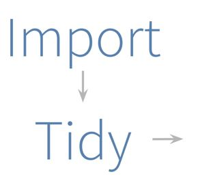
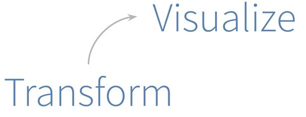
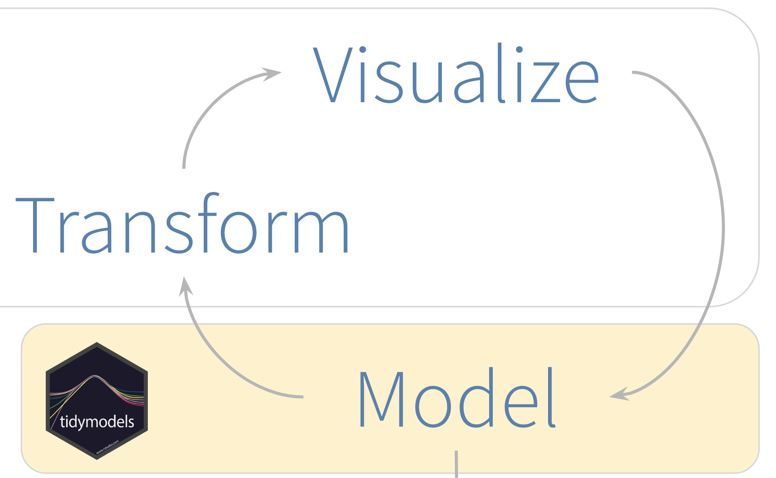
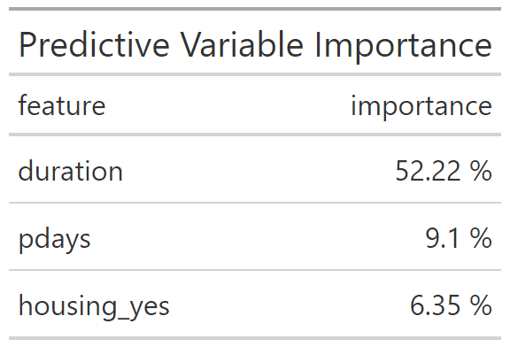

```{r setup, include=FALSE}
options(htmltools.dir.version = FALSE)
```

# Overview  
--
```{r eval=T, echo=F, tidy=FALSE, include=T}
knitr::include_graphics("pics/pipeline diagram.png")
```
---
### Prepare data pipeline from data sources [Bank Data](https://archive.ics.uci.edu/ml/machine-learning-databases/00222/bank.zip):
--
```{r eval=T, echo=F, tidy=FALSE, include=T}

```
---
### Clean, transform, and visualize data to optimize machine learning modeling and selection
--
```{r eval=T, echo=F, tidy=FALSE, include=T}

```
---
### Select Model based on performance prediction metrics and fine tune for optimal efficiency
--
```{r eval=T, echo=F, tidy=FALSE, include=T}

```
---
### Random Forrest, Evaluation, and Fine Tuning for Recommendations  

--
#### - While there are other ways to do feature selection, this method has an appealing simplicity and directness. The question we really want to answer with feature selection is ‘what would happen if I removed this feature’.   


--
#### - Our analysis shows, with minimal tuning, that **"Duration"** has the greatest predictive probability for customer purchases. "Duration" is last contact duration, in seconds (numeric).   


--
#### - A not-too-meaningless second place variable in our list of important predictors is **"Pdays"** which is the number of days that passed by after the client was last contacted from a previous campaign.   


---
## RF Data/Customer Feature Importance  

--
```{r eval=T, echo=F, tidy=FALSE, include=T}

```

---
## Outcome and Recommendation  

--
### - By and large the predictive model shows timely additional contact is what drives customers propensity to purchase.  

--
### - Moreover, contact in general yields the greatest predictive power and should be at the front-line of additional data and business tracking.  
  
--
- Thanks for viewing IXIS Data Science Challenge

---
class: inverse, middle, center

# The End  
### Mark D.

---

---
class: inverse, middle, center

# Are you still here? lol.

---


